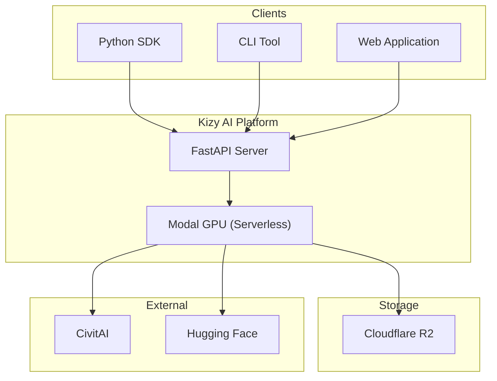
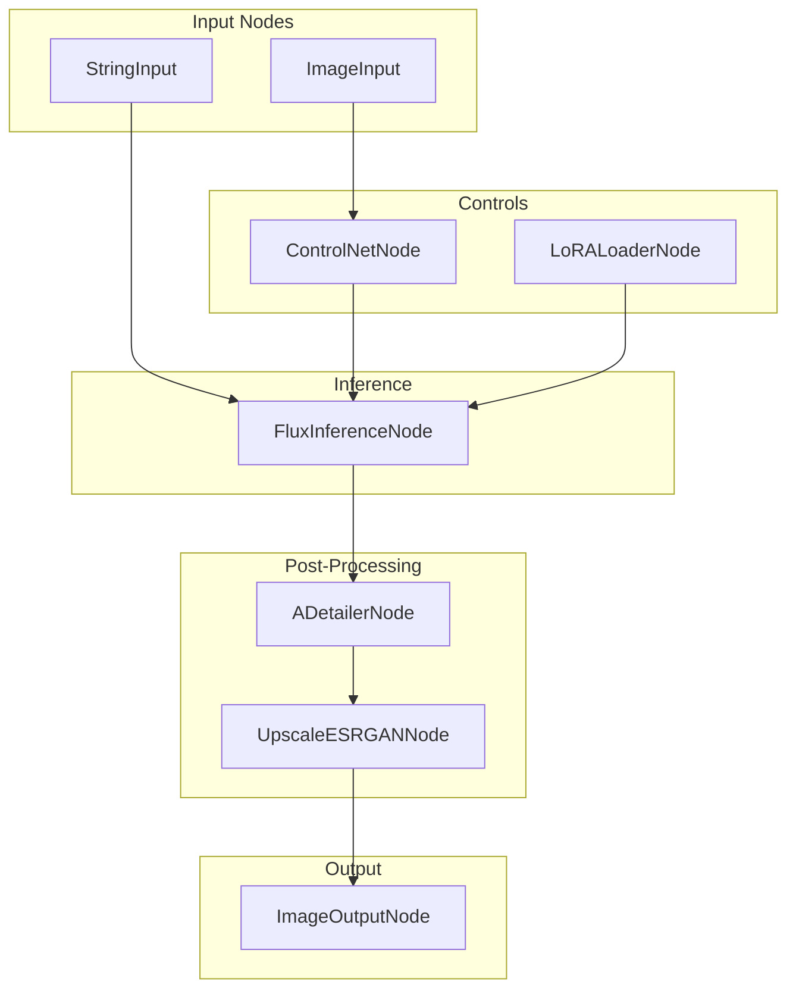

In this article, I present an opinionated open-source framework for diffusion based workflows, which includes running cloud inference, fine-tuning, and self-hosting - all through a simple and intuitive user interface.

**What is the problem we're solving?**

There's an interesting gap in the current AI image generation landscape. On one end, you have powerful but complex tools like ComfyUI that demand technical fluency. On the other, hosted APIs that abstract everything away, but at the cost of flexibility and control. Artists without engineering backgrounds are often left choosing between a steep learning curve or a walled garden. This framework is an attempt to explore what a middle open-source self-hosted path might look like.

We have consumer/prosumer grade products like ComfyUI, A111, Fooocus, etc that offer good control, but trade off on hardware or time. One the other, we have fully hosted cloud solutions like Replicate, Fal.AI. Then we have opinionated guides for deploying ComfyUI and similar WebUI's on runpod for better GPU provisioning. But it is to be noted that ComfyUI itself is not optimized for multi-gpu clusters.

Fine-tuning is a separate space, with famous open-source players like kohya ss and kohys sd scripts (built for stable diffusion), as well as hosted services like Civitai trainer.

We currently have the systems in place for these activities, and a professional (or a technically competent enthusiast/hobbyist) can easily generate high quality images. However, same cannot be said for pure artists, which severely limits the scope for these tools. To put is simply, we need an easily hostable open-source counterpart of fal.ai or replicate.

## Exploring the Problem Space

### Self-exploration

#### Inference

**Local Inference Tools (Open Source)**

| Tool | Use Case | Key Features | Pros | Cons |
|------|----------|--------------|------|------|
| **ComfyUI** | Prosumer/Enterprise | Node-based workflows, SD 1.5/SDXL/SD3.5/Flux support, extensive custom nodes | Most flexible, future-proof | Steep learning curve |
| **Automatic1111** | Consumer/Prosumer | Traditional UI, 20+ samplers, rich extension ecosystem, Forge fork available | Most mature, largest community | Less flexible than ComfyUI |
| **Fooocus** | Consumer | Simplified interface, 4GB VRAM minimum, one-click install | Best for beginners | Less customization |
| **InvokeAI** | Prosumer | Professional UI, Unified Canvas, advanced inpainting/outpainting | Most polished UI | Heavier resource requirements |

**Cloud API Providers**

| Provider | Use Case | Pricing | Key Differentiator |
|----------|----------|---------|-------------------|
| **Fal.AI** | Enterprise | Pay-per-use | Fastest inference (10x faster), 600+ models, $95M ARR |
| **Replicate** | Prosumer/Enterprise | Pay-per-second | Largest model library, one-line API |
| **Together.AI** | Enterprise | Usage-based | OpenAI-compatible API, $1.25B valuation |
| **Stability AI API** | Enterprise | Credit-based | Official SD source, early access to new releases |
| **Black Forest Labs** | Enterprise | $0.04/image | Highest quality (Flux 1.1 Pro, ELO 1153) |

**Hosted WebUI Platforms**

| Platform | Use Case | Pricing | Strengths |
|----------|----------|---------|-----------|
| **Midjourney** | All | $10-120/mo | Best photorealistic quality, v6.1 released |
| **Leonardo.AI** | Prosumer | Freemium | 16M+ users, Phoenix model, acquired by Canva |
| **DALL-E 3** | Consumer | $20/mo (ChatGPT+) | Best prompt adherence, ChatGPT integration |
| **Freepik Mystic** | Prosumer | Premium req. | Native 1K-4K resolution, Flux 1.1 + Magnific |
| **Ideogram AI** | Prosumer | Freemium | Best-in-class text rendering in images |
| **NightCafe** | Consumer | Freemium | Multi-model access (SDXL, DALL-E 3) |
| **Playground AI** | Consumer | Free (1000/day) | **Most generous free tier** |

**Serverless GPU Platforms**

| Platform | GPU Options | Pricing | Best For |
|----------|-------------|---------|----------|
| **RunPod** | RTX 3090/4090, A100, H100 | Pay-per-minute | GPU flexibility, pre-built templates |
| **Modal** | Auto-scaled | Serverless | Python devs, batch processing |
| **Baseten** | T4 to H100 | Freemium | Easy deployment with Truss framework |

**Community/Hybrid**

| Platform | Features | Pricing |
|----------|----------|---------|
| **Civitai** | 16K+ models, onsite generation, video | 100 free Buzz, $10/mo membership |
| **ThinkDiffusion** | Managed ComfyUI/A1111/Kohya in cloud | Subscription |

**Inference Summary (32 Solutions)**

| Priority | Recommended Solutions |
|----------|----------------------|
| Speed | Fal.AI, SDXL Turbo, TensorRT |
| Quality | Flux 1.1 Pro (BFL), Midjourney v6.1 |
| Cost | Local tools (free), Playground AI |
| Privacy | Draw Things, Mochi Diffusion (offline) |
| Beginners | Fooocus, NightCafe |
| Professionals | ComfyUI, InvokeAI |
| Enterprise | Fal.AI, Amazon Bedrock, Stability AI |

#### Fine-tuning

**Local Training Tools (Open Source)**

| Tool | Use Case | Key Features | VRAM | Strengths |
|------|----------|--------------|------|-----------|
| **Kohya_ss** | Consumer/Prosumer | LoRA, DreamBooth, SDXL, FLUX.1, SD3.5, GUI + CLI | Configurable | Most popular, best docs |
| **SimpleTuner** | Prosumer/Enterprise | Multi-modal (image/video/audio), DeepSpeed, FLUX.2 | 16-24GB | Best for FLUX.2 |
| **OneTrainer** | Consumer/Prosumer | FLUX.1, SD3.5, auto-backup, image augmentation | 7-10.3GB | Lowest VRAM requirements |
| **AI-Toolkit** | Prosumer | FLUX.1-dev specialized, WebUI option | 12-24GB | Fast FLUX LoRA training |

**Cloud Training Platforms**

| Platform | Use Case | Pricing | Key Features |
|----------|----------|---------|--------------|
| **Civitai Trainer** | Consumer/Prosumer | 500-2000 Buzz | Zero setup, web-based, SD/SDXL/Flux |
| **Replicate** | Prosumer/Enterprise | Pay-per-second | FLUX.1 fine-tuning, one-line API |
| **RunPod** | All | $0.50-2.79/hr | Pre-built Kohya template, 77-84% cheaper than AWS |
| **SaladCloud** | All | $0.08-0.14/job | Cheapest option, 60K+ GPUs, checkpoint recovery |
| **Modal** | Prosumer/Enterprise | Serverless | DreamBooth + LoRA for FLUX.1-dev |
| **Vast.ai** | Consumer/Prosumer | Marketplace | GPU marketplace, variable pricing |
| **Lambda Labs** | Enterprise | Hourly/weekly | 1-Click Clusters (16-512 H100s) |
| **fal.ai** | Prosumer/Enterprise | $0.008/step | FLUX.2 trainer, auto-captioning |
| **Astria AI** | All | $20 free credits | Multi-model, CivitAI import, FaceID adapter |

**Fine-tuning Summary (26 Solutions)**

| Priority | Recommended Solutions |
|----------|----------------------|
| Beginners | Civitai Trainer, Brev.dev (1-click), Textual Inversion |
| Budget | SaladCloud ($0.08/job), Brev.dev ($0.04/hr), Local OSS |
| FLUX Models | AI-Toolkit, SimpleTuner, fal.ai |
| Enterprise | Stability AI, Vertex AI, Lambda Clusters |
| Quick Iteration | InstantID (zero-shot), PhotoMaker (seconds) |
| Advanced | SimpleTuner (DeepSpeed), HF Diffusers, Kohya_ss |

### Interviews
I conducted around 10-15 interviews with people from the CivitAI, Stable Diffusion, and Midjourney discord which involved non-technical artists, technical artists (those who understand the diffusion space intuitively), and AI engineers working in this space. Here are my findings:

**Non-technical artists (5 interviews):**

- Most had tried Midjourney or DALL-E but felt "stuck" when results didn't match their vision
- 4/5 had attempted ComfyUI or A1111 but abandoned it within a week due to setup complexity
- Common sentiment: "I know exactly what I want, but I don't know how to tell the machine"
- Fine-tuning was seen as "something for developers, not for me"

**Technical artists (6 interviews):**

- All had working local setups (mostly ComfyUI or A1111 with custom workflows)
- Average time to get comfortable: 2-3 months of tinkering
- Main frustration: context-switching between inference, upscaling, and fine-tuning tools
- One interviewee: "I spend more time debugging Python environments than actually creating art"

**AI engineers (4 interviews):**

- Preferred API-based solutions (Replicate, fal.ai) for production work
- Acknowledged that current tools assume too much technical knowledge
- Expressed interest in self-hosted alternatives but cited "operational overhead" as a blocker
- One noted: "People need something nuanced but simple, and that is a hard problem to solve"

The interviews confirmed some of my assumptions. Those who are well established in this space (i.e. have been doing this for a while and are also technically competent) often find it much easier to product high-quality AI art. But newcomers, and pure artists often find it difficult to get started. Also, the focus shifts from WHAT to HOW, with many of the artistic details getting lost in the technicalities. A slight proof towards that is the fact that almost every person I interviewed agreed that it takes multiple tries and generations to get their vision right, and luck often plays its part (as is expected from stochastic models).

## Proposed Solution
The solution lies in the User Experience.

This brings us to a semi-formal system definition

## System Definition

Develop a system and pipeline(s) for AI based image/video generation. Key aspects:

1. Select from a bunch of available open models
2. Select / ask for auto-selection from all or sub-set of pre-existing LORA adapters that are:
a. Linked to some of these models
b. Linked to popular generation intents
3. Select from set of available effects / detailers (e.g., size, resolution)

### Generation experience

1. Natural language specification of the image / video the user desires
2. Optionally, a starting / guiding image / video to theme the generation on
3. Optionally, specific selections of the aspects above (of course there are default settings)

In addition the system also offers a fine-tuning experience.

### Fine-tuning experience

1. Upload images / videos, or a zip thereof
2. Goal name, and description - for what the images and videos semantically imply

As a result of the fine-tuning a LORA adapter is learnt, and is made available for selection in the generation experience.

## Architecture

Kizy AI is built on a **three-tier layered architecture** with a **plugin-based node system**:

1. **Interface Layer**: API, CLI, SDK for external access
2. **Orchestration Layer**: Workflow DAG execution, node registry, validation
3. **Compute Layer**: GPU inference (Modal serverless), model loading, node implementations

### System Context

### Node-Based Workflows

The core abstraction is a DAG of nodes. Each node is a discrete processing unit with typed inputs/outputs, discovered via Python entry points:

### Why This Design

- **Reference-based data flow**: Control plane passes R2 URL references only - compute nodes fetch/upload directly. This reduces memory overhead by ~90%.
- **Per-node checkpointing**: Each node execution is checkpointed to R2, enabling automatic retry on failure without losing progress.
- **Plugin extensibility**: Third-party nodes can be registered via `pyproject.toml` entry points, similar to how pytest plugins work.

## Execution

## Conclusion

The first prototype of [Kizy API v1](https://gist.github.com/esxr/ceea3e3a049a3e5c73ed05704436ad4d) has been deployed.

Note that v0 is a bit different from the proposed architecture because we want a quick version for testing against real users. Right now, our framework is imperatively defined (i.e. no controls for using custom detailers, models etc.), and the exact workflow (prompt -> model -> detailers) is also hardcoded.

## Future Directions

Currently, we have a deployed API to abstract out the individual processes of fine-tuning, inference and other things, and expose an easy to use interface to help generate images/videos using any model, and be able to apply multiple before/after detailers (ESRGan based etc). However, there is a lot of scope for improvement right now (which I will be possibly covering in future blogs):

Phase 1: Implement v1 according to the described architecture (with a node based DAG graph orchestration plus a robust plugin system for BYO detailers, models etc.)

Phase 2: Package our server as an MCP. This is a low-hanging fruit, but I believe this might add a lot of value to artists who are looking to define their creations or workflows in natural language, and then we can use the power of LLMs to formulate the best possible combination of models and effects to act on these definitions. This could theoretically make it simpler for users to consume our software (by simply adding a few MCP configs to their current desktop assistants).